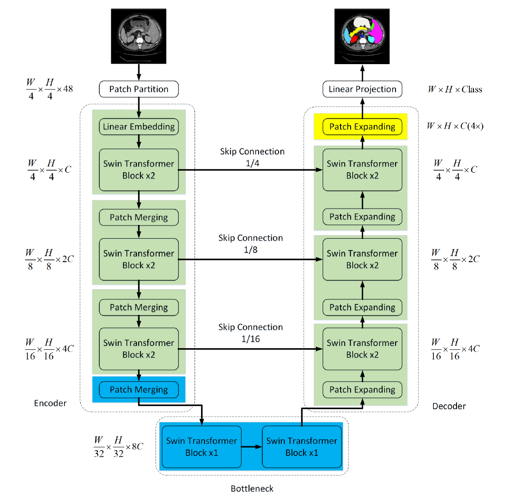

# 总述
该项目为Swin-Unet的TensorRT优化实现。原始模型Github项目主页：[Swin-Unet](https://github.com/HuCaoFighting/Swin-Unet)
## 优化效果
相比TensorRT默认方案优化后FP32下dice平均误差为0.011，hd96平均误差为0.046，加速比为14.5%；TF32下dice平均误差为0.011，hd96平均误差为0.072，加速比为5.9%。
## 运行步骤
首先创建Docker容器，将项目文件夹挂载至Docker容器内，例如：

```
docker run -ti --gpus all -v ProjectPath:/target nvcr.io/nvidia/pytorch:21.07-py3
```
然后进入项目文件夹：
```
cd /target
```

首先安装kineto：

```
git clone --recursive https://github.com/pytorch/kineto.git
cd kineto/libkineto
mkdir build && cd build
cmake ..
make
make install
```

安装其他依赖：

```
pip install -r requirements.txt
```

如果设备用不了编译完的Plugin可以自行编译
编译FasterTransformer：（DSM根据具体设备算力指定）

```
git clone -b FasterTransformer https://github.com/misaka0316/TRT-for-Swin-Unet.git
cd FasterTransformer
mkdir -p build
cd build
cmake -DSM=86 -DCMAKE_BUILD_TYPE=Release -DBUILD_PYT=ON -DBUILD_TRT=ON ..
make
```

编译LayerNormPlugin，并将编译好的FasterTransformer相关的动态链接库拷贝到ONNXToTensorRT/plugin：
```
cd ONNXToTensorRT/plugin
make
cp ../../FasterTransformer/build/lib/libswinTransformer_plugin.so .
cp ../../FasterTransformer/build/lib/libpyt_swintransformer.so .
```

准备Onnx模型，可参考`PytorchToONNX/PytorchToOnnx.py`将Onnx模型导出至`model`下(复赛验证请[点击这里](https://pan.baidu.com/s/17TYOtAkxrElbiiIc7cz6tg?pwd=iiji)下载模型与验证数据，模型存放至`model`目录下，验证数据集存放在`Swin-Unet-main/datasets/Synapse/test_vol_h5/`目录下)

构建TensorRT引擎：（需要在ONNXToTensorRT目录下运行）

```
cd ONNXToTensorRT
mkdir -p output
python ONNXToTensorRT.py --flag TF32
```

生成的.plan文件将存放在`ONNXToTensorRT/output`目录下
执行推理测试：（需要在ONNXToTensorRT目录下运行）

```
python testPlan-B1.py --flag TF32
```

# 原始模型
## 模型简介
Swin-Unet主要面向的任务为医学影像分割，该模型借鉴了Unet中的U形结构和跳跃连接，设计了具有移位窗口的分层Swin Transformer作为编码器来提取特征，以及基于对称Swin Transformer的解码器，该解码器具有补丁扩展层，用于执行上采样操作以恢复特征图的空间分辨率。该模型在Automatic Cardiac Diagnosis Challenge (ACDC)数据集上获得了global rank 2的成绩。
## 模型优化的难点
模型中不同模块替换时无法统一处理，需要分别处理，并且模型存在跳跃连接，现有的FasterTransformer中的方案无法直接使用，需要进行修改。


# 优化过程
选定题目之后，按照原模型Github主页说明成功进行了模型的训练，拿到了训练好的PyTorch模型之后，首先进行Onnx模型的导出，因为模型推理时候的`image_size`与训练时用的`image_size`一致，并且使用的数据集的channl都为1，所以导出的Onnx模型输入shape为`(B, 1, 224, 224)`。在导出过程中需要指定`opset_version=13`，因为Swin Transformer中的SW-MSA部分涉及到`torch.roll`操作，该算子需要在`opset_version=13`下才能支持导出。
这里插播一小段岔路，在Swin-Unet原作者请求得到数据集之后，最开始错用了作者提供的ViT based Unet，然后导出Onnx模型在TensorRT onnxParser过程中会遇到以下错误：
```
In node xx (parseGraph): INVALID_NODE: Invalid Node - Conv_xx
Conv_xx: two inputs (data and weights) are allowed only in explicit-quantization mode.
```
造成错误的原因是多输入卷积不能被TensorRT解析，TensorRT通过ConvMultiInput来实现这种卷积（多输入卷积），但是只支持INT8显式量化。
解决思路：
- 经测试可以使用onnxsim对导出的Onnx模型进行自动优化，优化之后的Onnx模型可以被TensorRT正确解析。
- 参照[TensorRT动态卷积自定义op](https://blog.csdn.net/Fenplan/article/details/122348409)

回到Swin-Unet的优化，Swin based Unet的Onnx模型导出之后，能够直接使用onnxParser进行解析并成功构建引擎，然后对于原模型的TensorRT自动优化方案进行了FP32、TF32、FP16不同精度测试，测试的GPU为A10，推理shape为`(1, 1, 224, 224)`，使用作者提供的测试集中的3组进行测试，然后根据原模型的metric计算来得出测试结果，测试结果如下：

| item | mean_dice | mean_hd95 | infer_time(per barch) |
| --- | --- | --- | --- |
| torch | 0.883 | 3.984 | \ |
| FP32 | 0.872 | 3.977 | 5.489ms |
| TF32 | 0.872 | 3.930 | 4.621ms |

接下来是Nsight分析，下图为Nsight system中网络的一次完整推理过程：

从图中可以得出，TensorRT将除了网络开始的Embedding以及最后的Projection以外的所有节点都融合为一个Foreign Node，下图为一次推理过程的time line events：

时间占比最高的部分带有sqrt、mul、add等操作，推测为Swin-block中的LayerNorm及MLP计算，并且下采样部分Swin-block中的gemm Theoretical occupancy 较低，如下图所示，所以优化的目标先指向了Swin-block。


因为在[NVIDIA-FasterTransformer](https://github.com/NVIDIA/FasterTransformer)找到了Swin的相关优化实现源码，所以决定借鉴该实现来优化Swin-Unet，借鉴过程如下：
FasterTransformer中提供了Swin相关的使用例子，首先分析Swin的计算过程，如下图所示：

对比分析Swin-Unet的解构：

对比Swin-Unet与FasterTransformer中的Swin Plugin的计算过程，差异如下：
- Swin-Unet下采样部分第3个Stage只用了2个Swin-block
- Swin-Unet没有采用AvgPool
- 上采样中的Stage把Patch Merging换成了Parch Expanding

以下为FasterTransformer Swin Plugin的结构：
```
SwinTransformerPlugin
├── Patch Embedding
│  
├── SwinTransformerBasicLayer × Layer_num
│   ├── SwinTransformerBlock
│   └── Patch Merging
│
└── AVG Pool
```
该Plugin与Swin-Unet的下采样过程非常相似，但是从Swin-Unet的网络结构图中可以得知，在下采样过程中的Swin-Block与上采样过程中对应的Swin-Block进行了跳跃连接，所以无法直接采用该Plugin，后续优化中采用的是对下采样过程中的Swin-Block使用FasterTransformer中的SwinTransformerBlock进行替换，主要是为了优化W-MSA(Window Multi-head Self-Attention模块)以及SW-MSA(Shifted-Window Multi-head Self-Attention模块)的计算以及上文中提到的LayerNorm+MLP的计算.  

接下来详细介绍替换过程：
在替换过程中，我们采用了FasterTransformer中的SwinBasicLayer作为Swin-Unet下采样过程的Swin-Block × 2替换，SwinBasicLayer的具体实现以及修改位于:
`FasterTransformer/src/fastertransformer/models/swin/SwinBasicLayer.cc`.  

该部分修改禁用了Patch Merging，禁用的原因为：在网络结构图中的一个Stage是由Patch merging + Swin-Block组成的，但是
FasterTransformer中的实现是Swin-Block + Patch merging，而Swin-Block的输出需要传递给上采样部分，Patch merging的优化效果相比Swin-Block会显得非常小，所以没有对Patch merging进行优化。

在代码中，我们根据输入张量的最后两维来判断是否需要做Patch Partition以及Linear Embedding，即除了第一个Swin-Block前需要做该操作以外，其余的Swin-Block都不需要。最后将相关代码封装成了Plugin.

然后需要在Onnx中把下采样过程中的Swin-Block进行替换。在这部分工作中，因为我们没有采用通过Plugin的input来进行传参，而是使用PluginFieldCollection进行传参然后创建Plugin进行Layer的替换。我们首先使用了OnnxGraphSurgeon在Onnx模型将Swin-Block暂时替换为一个临时节点，替换为临时节点的目的是为了防止TensorRT OnnxParser过程中对待替换的Swin-Block内部节点进行操作（例如与后续Swin-Block外的节点进行连接），替换之后在TensorRT中对Onnx模型进行Parser，然后分别创建4个Plugin，并使用PluginFieldCollection进行参数权重的传递，详细的传参操作在`ONNXToTensorRT/plugin/LoadSwinTransformerWeightTransposeQKVWeight.py`中，然后使用TensorRT中的API进行Surgeon，把4个临时节点替换为Plugin，然后进行引擎的构建及保存。
# 精度与加速效果
优化前：

| item | mean_dice | mean_hd95 | infer_time(per barch) |
| --- | --- | --- | --- |
| torch | 0.883 | 3.984 | \ |
| trt-FP32 | 0.872 | 3.977 | 5.489ms |
| trt-TF32 | 0.872 | 3.930 | 4.621ms |
| OnnxRuntime | \ | \ | 102.320ms |

优化后：

| item | mean_dice | mean_hd95 | infer_time(per barch) |
| --- | --- | --- | --- |
| torch | 0.883 | 3.984 | \ |
| trt-FP32 | 0.872 | 3.930 | 4.693ms |
| trt-TF32 | 0.872 | 3.912 | 4.347ms |
| OnnxRuntime | \ | \ | 102.320ms |

测试精度使用的为原模型作者提供的测试集中的一个case，图像尺寸为`(224, 224)`，在A10上使用镜像`nvcr.io/nvidia/pytorch:21.07-py3`创建进行的测试。相比TensorRT默认方案优化后FP32下dice平均误差为0.011，hd96平均误差为0.046，加速比为14.5%；TF32下dice平均误差为0.011，hd96平均误差为0.072，加速比为5.9%。FP32下相比OnnxRuntime加速比为95.8%。
测试方式如下：
- TensorRT原始方案测试：

```
cd basic
mkdir -p output
python Parser.py --flag FP32/TF32
python testPlan-B1.py --flag FP32/TF32
```

- 优化后方案测试：
```
cd ONNXToTensorRT
mkdir -p output
python ONNXToTensorRT.py --flag FP32/TF32
python testPlan-B1.py --flag FP32/TF32
```

- OnnxRuntime测试：
```
cd basic
mkdir -p output
python onnx_inference.py
```

- Pytorch原模型推理测试参照`Swin-Unet-main/README.md`

在尝试FP16模式构建时，在该镜像下(TensorRT版本为8.0.1.6)会产生以下错误：
```
[TensorRT] VERBOSE: *************** Autotuning format combination: Half(1:16,768,1) -> Half(37632,768,1) ***************
terminate called after throwing an instance of 'std::runtime_error'
  what():  [FT][ERROR] CUDA runtime error: out of memory /workspace/FasterTransformer/src/fastertransformer/tensorrt_plugin/swin/swinTransformerPlugin.h:198
```
该错误尚未定位到具体原因，还未解决，所以最终测试结果没有做FP16情况下的测试。

# Citation
```bibtex
@misc{cao2021swinunet,
      title={Swin-Unet: Unet-like Pure Transformer for Medical Image Segmentation}, 
      author={Hu Cao and Yueyue Wang and Joy Chen and Dongsheng Jiang and Xiaopeng Zhang and Qi Tian and Manning Wang},
      year={2021},
      eprint={2105.05537},
      archivePrefix={arXiv},
      primaryClass={eess.IV}
}
```
